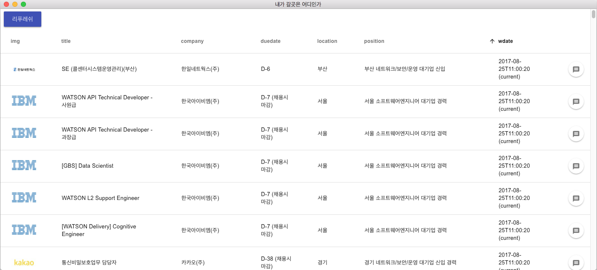

# recruit board

> 구직사이트 몰래 보려고 하루만에 날림으로 만듬. 근데 소스가 공개되면 몰래가 아니잖아?... 아 나도 모르겠당




## specification
### client
- electron
- electron-vue
- vue-material

나머지는 조금 애매해서 client만 공개
### server
- aws lambda
- aws api gateway
- dynamoDB

### batch
- python 3.5
- scrapy

#### Build Setup

``` bash
# install dependencies
npm install

# serve with hot reload at localhost:9080
npm run dev

# build electron application for production
npm run build

# run unit tests
npm test


```

---

This project was generated with [electron-vue](https://github.com/SimulatedGREG/electron-vue)@[e04a5b5](https://github.com/SimulatedGREG/electron-vue/tree/e04a5b5f09f63265939e00c9dc59a612d9da5bc8) using [vue-cli](https://github.com/vuejs/vue-cli). Documentation about the original structure can be found [here](https://simulatedgreg.gitbooks.io/electron-vue/content/index.html).
